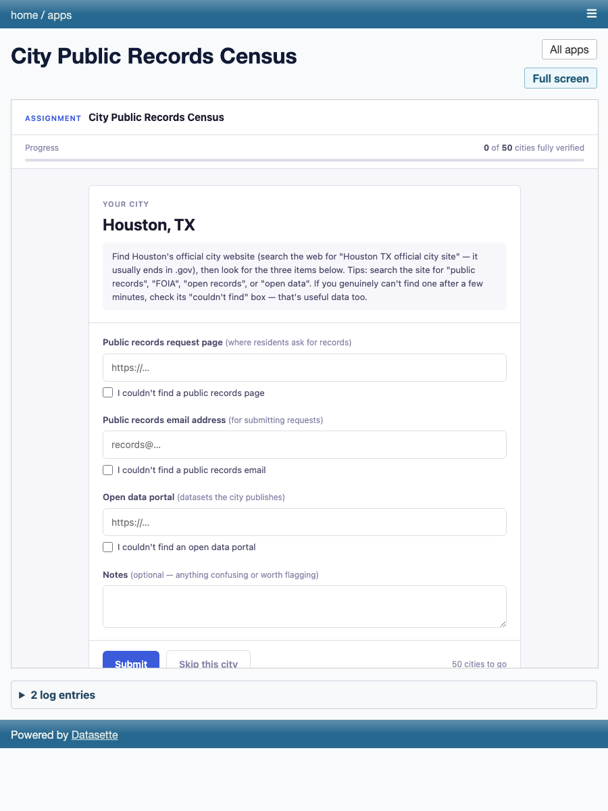

# Build a Crowdsourcing Assignment with Datasette

## What you'll build



You are going to build a crowdsourcing page where anyone can help verify facts, with every response landing in a database you can search, facet, and export.

The example throughout this guide is the City Public Records Census — a running demo at <https://records-census-demo.fly.dev> where contributors find each city's public-records page, records email, and open-data portal. By the end you will have your own version of that, pointed at your own data.

---

## What you'll need

- A computer with Python 3.10 or newer
- About 20 minutes (plus optional extra time to publish it)
- A terminal (on Mac: Terminal.app; on Windows: PowerShell or WSL)
- Optionally, a [Fly.io](https://fly.io) account (free) if you want to publish the app so others can reach it

You do not need to know Python or SQL to follow this guide. You will run a few commands and copy a few snippets. Every step says *why* before *how*.

<details>
<summary>Under the hood</summary>

The stack is three small, focused tools:

- **[Datasette](https://datasette.io)** turns a SQLite file into a web UI with an API — browse tables, run SQL, export CSV, set permissions. Think of it as a read-friendly layer on top of a database file.
- **[datasette-apps](https://datasette.io/blog/2026/datasette-apps/)** adds a sandboxed "app" concept: a single HTML file that runs inside Datasette, can read any table with `datasette.query()`, and can write through named stored queries with `datasette.storedQuery()`. The sandbox (`<iframe sandbox="allow-scripts allow-forms">` plus a strict Content Security Policy) means apps cannot make arbitrary network requests or access Datasette internals.
- **[datasette-auth-passwords](https://github.com/simonw/datasette-auth-passwords)** adds username/password login. The admin (you) logs in; contributors do not need accounts.

Everything runs on one SQLite file per database. There is no Postgres, no Redis, no message queue. That keeps the cost of a deployed instance around $2–4 per month on Fly.io.

</details>

---

> **The no-code way**
>
> If you want to create an assignment without writing SQL or HTML, the
> `datasette-assignments` plugin adds a point-and-click wizard at
> `/-/assignments/new`. Install it with
> `pip install -e plugins/datasette-assignments`, log in, and the wizard
> walks you through both task-based and form-based assignments.
> See the [plugin README](plugins/datasette-assignments/README.md) for the
> full setup, privacy model, and route reference.
>
> The rest of this tutorial follows the hand-built path, which is the best
> way to understand how the pieces fit together.

---

## Step 1: Install

Pinned versions matter here. Datasette 1.0 is still in alpha, and plugin APIs change between releases. The combination below is tested and working.

```bash
python3 -m venv .venv
.venv/bin/pip install datasette==1.0a35 datasette-apps==0.1a3 datasette-auth-passwords==1.1.1
```

The first command creates a local Python environment so these packages do not collide with anything else on your system. The second installs the three pieces of the stack.

> **Why pinned versions?** Unpinned installs can silently break things — for example, `datasette-upload-csvs` crashes the 1.0a35 homepage with an `AttributeError` if you add a slightly different alpha. See [NOTES.md](NOTES.md) for details and how to test any additions locally.

Verify the install worked:

```bash
.venv/bin/datasette --version
```

You should see something like `datasette, version 1.0a35`.

---

## Step 2: Describe your task as a CSV

Every assignment starts with a list of tasks — one row per thing you want a contributor to do. Keep each task small enough to finish in a few minutes: one city, one document page, one record to verify.

For the census assignment, the task list is `cities.csv`. Its first few rows:

```
city,state
New York,NY
Los Angeles,CA
Chicago,IL
Houston,TX
Phoenix,AZ
```

The two columns are `city` and `state`. Contributors will find each city's official website themselves — that is part of the task — so the CSV does not need a website column.

One row equals one task someone can do in a few minutes. That constraint is the main design decision. If a task takes 30 minutes or requires specialized knowledge, most contributors will stop. Aim for: open a search engine, find a page, copy a URL, submit. Three to five minutes per city is a reasonable target.

<details>
<summary>Under the hood: designing good microtasks</summary>

Three principles from experience:

**Small and verifiable.** A contributor should be able to check their own answer before submitting. "Paste the URL of the public-records page" is verifiable; "summarize this city's records policy" is not.

**Redundant by default.** This app collects three responses per task (`responses_per_task = 3`) and reconciles afterwards. That redundancy catches honest mistakes and the occasional bad-faith response without needing a moderator in the loop. See the SQL in Step 8 for the reconciliation query.

**Explicit absence is data.** A blank field is ambiguous — did the contributor skip it, or is there genuinely no record? The census app uses a "couldn't find" checkbox per field. A checked box means the contributor looked and found nothing. That's useful. A blank means nothing. Always give contributors a way to signal absence.

</details>

---

## Step 3: Build the task database

The database holds your task list, every response, and one configuration value. The setup script creates it (or safely updates it if it already exists).

```bash
python scripts/setup_census.py
```

You will see:

```
Loaded 50 city tasks.
Database ready: /path/to/census.db
```

If you run it again, the tasks table already has rows, so the script skips the load and just prints a confirmation. It never wipes data.

<details>
<summary>Under the hood: the schema and the mark_task_done trigger</summary>

The script creates three tables:

**`tasks`** — one row per city. Status starts as `pending` and flips to `done` once enough responses arrive.

```sql
CREATE TABLE IF NOT EXISTS tasks (
    id INTEGER PRIMARY KEY AUTOINCREMENT,
    city TEXT NOT NULL,
    state TEXT NOT NULL,
    status TEXT NOT NULL DEFAULT 'pending',   -- 'pending' | 'done'
    created_at TEXT DEFAULT (datetime('now'))
);
```

**`responses`** — one row per submission. Each field has a companion `_missing` integer (0 = value provided, 1 = contributor checked "couldn't find").

```sql
CREATE TABLE IF NOT EXISTS responses (
    id INTEGER PRIMARY KEY AUTOINCREMENT,
    task_id INTEGER NOT NULL REFERENCES tasks(id),
    records_page_url TEXT,
    records_page_missing INTEGER NOT NULL DEFAULT 0,
    records_email TEXT,
    records_email_missing INTEGER NOT NULL DEFAULT 0,
    data_portal_url TEXT,
    data_portal_missing INTEGER NOT NULL DEFAULT 0,
    notes TEXT,
    submitted_at TEXT DEFAULT (datetime('now'))
);
```

**`config`** — a key/value table. One row: `responses_per_task = 3`.

```sql
CREATE TABLE IF NOT EXISTS config (
    key TEXT PRIMARY KEY,
    value TEXT NOT NULL
);
```

**Why a trigger?** Datasette's stored write queries execute exactly one SQL statement. You cannot do `INSERT ... ; UPDATE tasks SET status = 'done' ...` in a single stored query. The solution is a SQLite trigger that fires automatically after every `INSERT` on `responses`:

```sql
DROP TRIGGER IF EXISTS mark_task_done;
CREATE TRIGGER mark_task_done
AFTER INSERT ON responses
BEGIN
    UPDATE tasks SET status = 'done'
    WHERE id = NEW.task_id
      AND (SELECT COUNT(*) FROM responses WHERE task_id = NEW.task_id)
          >= (SELECT CAST(value AS INTEGER) FROM config WHERE key = 'responses_per_task');
END;
```

The trigger reads `responses_per_task` from the `config` table at runtime — the app, the task-selection SQL, and the trigger all read the same number from the same place. Change it in one spot and everything adjusts.

</details>

---

## Step 4: Run it locally

Before publishing anything, confirm the app runs on your machine.

First, generate a secret key (Datasette uses it to sign session cookies) and a hashed admin password. The hash goes into an environment variable so it never lives in plain text on disk.

```bash
export DATASETTE_ROOT_PASSWORD_HASH=$(
  .venv/bin/python -c \
  "from datasette_auth_passwords.utils import hash_password; print(hash_password('yourpassword'))"
)
```

Replace `yourpassword` with something you will remember. Then start Datasette:

(`assignments.db` is this repo's second example — the Document Review app's database, built by `scripts/setup_documents.py`. If you're working with just your own census-style database, leave it off the command.)

```bash
.venv/bin/datasette serve census.db assignments.db \
  --internal internal.db \
  -c datasette.yaml \
  --secret dev-secret-change-in-prod
```

Open <http://127.0.0.1:8001> in your browser. You should see Datasette's table browser with the `census` database listed. Click through to the `tasks` table — you will see all 50 cities.

To log in as admin, go to <http://127.0.0.1:8001/-/login> and use username `root` and the password you set above.

> **Note:** `dev-secret-change-in-prod` is fine for local testing. On a deployed server you need a stable secret stored as an environment variable or Fly secret, or every restart will invalidate all admin sessions.

Press `Ctrl-C` in the terminal to stop the server.

---

## Step 5: The assignment app

The app is a single HTML file in `apps/census.html`. Datasette-apps stores it inside `internal.db`. The `sync_apps.py` script syncs the file from the repo into the database:

```bash
python scripts/sync_apps.py
```

Output:

```
created app 'City Public Records Census' -> <app-id>
Done. Restart Datasette to pick up changes.
```

After restarting Datasette, go to <http://127.0.0.1:8001/-/apps> and click the app. Contributors reach it at `http://127.0.0.1:8001/-/apps/<app-id>`.

If you edit `apps/census.html` later, run `python scripts/sync_apps.py` again. It detects the change and saves a new revision. The app builder's web editor is a preview surface; the repo file is the source of truth.

**Tour of `apps/census.html`:**

The app's JavaScript has three moving parts:

1. **Progress query.** On load, `loadProgress()` calls `datasette.query(DB, sql)` to count total tasks and how many are done, then updates the progress bar.

2. **Task selection.** `loadNextTask()` picks one undone task the current browser session has not already seen:
   ```sql
   SELECT t.id, t.city, t.state
   FROM tasks t
   WHERE (SELECT COUNT(*) FROM responses r WHERE r.task_id = t.id)
         < (SELECT CAST(value AS INTEGER) FROM config WHERE key = 'responses_per_task')
     AND t.id NOT IN (...)   -- session-seen list
   ORDER BY RANDOM()
   LIMIT 1
   ```
   `ORDER BY RANDOM()` distributes load across all open tasks so no single city always gets answered first.

3. **Submission.** `submitResponse()` calls `datasette.storedQuery(DB, "submit_response", params)` to write a row. The params object matches the named parameters in `datasette.yaml`'s `submit_response` stored query.

<details>
<summary>Under the hood: datasette.query() and datasette.storedQuery()</summary>

Datasette-apps provides two JavaScript functions to every app:

**`datasette.query(database, sql, params?)`** — read-only. Runs arbitrary SQL and returns `{ rows: [...], columns: [...] }`. Each row is an object keyed by column name. Use it for anything that reads data: progress counts, task selection, leaderboards.

**`datasette.storedQuery(database, name, params?)`** — write-capable. Calls the stored query by name (as defined in `datasette.yaml`) and returns `{ ok: true, ... }`. This is the only write path available to app contributors.

Why two separate functions? Security. `datasette.query()` is read-only by design — there is no way for an app to exfiltrate or modify data using it alone. Write access is gated through named stored queries, each of which you configure and audit in `datasette.yaml`. You decide exactly which parameters are accepted and what SQL they run.

The stored query for the census app (from `datasette.yaml`):

```yaml
submit_response:
  sql: |
    INSERT INTO responses (
      task_id,
      records_page_url, records_page_missing,
      records_email, records_email_missing,
      data_portal_url, data_portal_missing,
      notes, submitted_at
    ) VALUES (
      :task_id,
      :records_page_url, :records_page_missing,
      :records_email, :records_email_missing,
      :data_portal_url, :data_portal_missing,
      :notes, datetime('now')
    );
  write: true
  allow: true
```

`write: true` enables INSERT/UPDATE/DELETE. `allow: true` lets everyone (including logged-out visitors) call it. If you wanted only logged-in users to submit, you would change `allow: true` to `allow: { actor: { id: "root" } }` or similar.

One important gotcha: if you use `allow: { unauthenticated: true }` instead of `allow: true`, you silently lock out the signed-in admin. `{unauthenticated: true}` matches only logged-*out* users. `allow: true` matches everyone. See [NOTES.md](NOTES.md) for the full permissions rundown.

</details>

---

## Step 6: Make it yours — styled building blocks

This section is a copy-paste library. Each snippet uses the app's CSS variables (`--accent`, `--rule`, `--ink`, etc.) so it drops in without clashing with the existing styles.

### Multiple-choice question (radio cards)

Use this when you want a click-to-select card layout instead of dropdown menus.

```html
<div class="field-group">
  <label>Is this a public records page?</label>
  <div class="choice-row">
    <label class="choice"><input type="radio" name="verdict" value="yes"> Yes</label>
    <label class="choice"><input type="radio" name="verdict" value="no"> No</label>
    <label class="choice"><input type="radio" name="verdict" value="unsure"> Not sure</label>
  </div>
</div>
<style>
.choice-row { display: flex; gap: 8px; }
.choice {
  flex: 1; display: flex; align-items: center; justify-content: center; gap: 8px;
  padding: 10px; border: 1px solid var(--rule); border-radius: 6px;
  cursor: pointer; font-weight: 600; transition: border-color 0.12s, background 0.12s;
}
.choice:has(input:checked) {
  border-color: var(--accent); background: rgba(59,91,219,0.06); color: var(--accent);
}
</style>
```

The `:has(input:checked)` selector highlights the card whose radio is selected. It works in all modern browsers (Chrome 105+, Firefox 121+, Safari 15.4+).

When you submit, read the value with:
```js
const verdict = document.querySelector('input[name="verdict"]:checked')?.value;
```

### Image task card (DocumentCloud page images)

Use this when your task involves reviewing a document page. The skeleton loader shows while the image loads, so contributors always see something immediately.

Copy these CSS classes from `apps/document_review.html`:

```html
<style>
.page-wrap { background: #ececf3; padding: 16px; display: flex; justify-content: center; border-bottom: 1px solid var(--rule); }
.page-img {
  max-width: 100%; height: auto; display: block;
  background: #fff; border: 1px solid var(--rule);
  box-shadow: 0 2px 10px rgba(26,26,46,0.10);
}
.page-skeleton {
  width: 100%; max-width: 612px; aspect-ratio: 612 / 792;
  background: linear-gradient(100deg, #e4e4ee 30%, #f0f0f6 50%, #e4e4ee 70%);
  background-size: 200% 100%; animation: shimmer 1.3s linear infinite;
  border: 1px solid var(--rule); border-radius: 2px;
}
@keyframes shimmer { to { background-position: -200% 0; } }
</style>

<div class="page-wrap">
  <div class="page-skeleton" id="skeleton"></div>
  
</div>
<script>
const img = document.getElementById("page-img");
const skeleton = document.getElementById("skeleton");
img.onload = () => { skeleton.style.display = "none"; img.style.display = "block"; };
img.src = "https://s3.documentcloud.org/documents/YOUR_DOC_ID/pages/YOUR_SLUG-p1-normal.gif";
</script>
```

Replace `YOUR_DOC_ID` and `YOUR_SLUG` with the DocumentCloud document ID and slug. DocumentCloud serves every page as a static image at URLs like:
```
https://s3.documentcloud.org/documents/{id}/pages/{slug}-p{page}-{size}.gif
```
Sizes: `small`, `normal`, `large`, `xlarge`.

**CSP note:** The datasette-apps sandbox blocks all external content by default. To allow images from DocumentCloud, an administrator adds the origin to `allowed_csp_origins` in `datasette.yaml`, and the app opts in via its allowed-origins field in the app editor. Images load. Iframes and oEmbed do not — there is no `frame-src` in the CSP and that is deliberate. See [NOTES.md](NOTES.md) for the full explanation.

### Star/scale rating

Use this when you want a numeric rating (readability, confidence, priority) without a text box.

```html
<div class="field-group">
  <label>How readable is this page?</label>
  <div class="scale" id="scale">
    <button type="button" data-v="1">1</button>
    <button type="button" data-v="2">2</button>
    <button type="button" data-v="3">3</button>
    <button type="button" data-v="4">4</button>
    <button type="button" data-v="5">5</button>
  </div>
</div>
<style>
.scale { display: flex; gap: 6px; }
.scale button {
  width: 42px; height: 42px; border: 1px solid var(--rule); border-radius: 6px;
  background: #fff; font: inherit; font-weight: 700; cursor: pointer;
}
.scale button.active { background: var(--accent); border-color: var(--accent); color: #fff; }
</style>
<script>
document.querySelectorAll("#scale button").forEach(b =>
  b.onclick = () => {
    document.querySelectorAll("#scale button").forEach(x => x.classList.remove("active"));
    b.classList.add("active");
    window.scaleValue = Number(b.dataset.v);
  });
</script>
```

Read the value at submit time with `window.scaleValue`. If nothing is selected, it will be `undefined` — validate before allowing submit.

### "Couldn't find it" pattern

A blank field is ambiguous. This pattern — from `apps/census.html` — uses a checkbox to explicitly flag absence. The checkbox disables the input and clears its value, so the distinction between "left blank" and "checked not found" is preserved in the data.

```html
<div class="field-group" id="group-portal">
  <label for="portal">Open data portal <span class="hint">(URL)</span></label>
  <input type="url" id="portal" placeholder="https://…" autocomplete="off">
  <div class="missing-row">
    <input type="checkbox" id="portal-missing" onchange="toggleMissing('portal')">
    <label for="portal-missing" style="font-weight:400">I couldn't find an open data portal</label>
  </div>
  <div class="field-error" id="portal-error"></div>
</div>
<style>
.missing-row { display: flex; align-items: center; gap: 7px; font-size: 13px; color: var(--ink-mid); }
.missing-row input { accent-color: var(--accent); width: 15px; height: 15px; }
.field-error { font-size: 12px; color: var(--warn); display: none; }
.field-group.invalid .field-error { display: block; }
</style>
<script>
function toggleMissing(key) {
  const input = document.getElementById(key);
  const missing = document.getElementById(key + "-missing").checked;
  input.disabled = missing;
  if (missing) input.value = "";
}
</script>
```

In your stored query, add a companion integer column: `portal_missing INTEGER NOT NULL DEFAULT 0`. Pass `portal_missing: 1` when the box is checked, `0` otherwise.

Why flagged absence beats a blank: when you analyze the results in SQL, you can distinguish `WHERE portal_missing = 1` (genuinely not found) from `WHERE portal_url IS NULL AND portal_missing = 0` (contributor skipped). Those two groups need different follow-up.

### Theme it

All the visual styling comes from CSS variables on `:root`. To change the look of the whole app, replace the variable block at the top of the `<style>` section.

Default (blue accent):
```css
:root {
  --ink: #1a1a2e; --ink-mid: #4a4a6a; --ink-soft: #8888aa;
  --paper: #f7f7fb; --rule: #dddde8;
  --accent: #3b5bdb; --accent-dk: #2f4ac5;
  --ok: #2f9e44; --warn: #e67700; --radius: 6px;
}
```

Warm newsroom palette (dark red accent):
```css
:root {
  --ink: #1c1410; --ink-mid: #5a4a40; --ink-soft: #9a8a80;
  --paper: #faf8f5; --rule: #e8e0d8;
  --accent: #c0392b; --accent-dk: #a93226;
  --ok: #27ae60; --warn: #d35400; --radius: 4px;
}
```

Civic green palette:
```css
:root {
  --ink: #0f1f18; --ink-mid: #3a5a4a; --ink-soft: #7a9a8a;
  --paper: #f4f9f6; --rule: #d4e8dc;
  --accent: #1a7a4a; --accent-dk: #156040;
  --ok: #0d6e37; --warn: #b35900; --radius: 8px;
}
```

Pick one, paste it in, save, re-sync with `python scripts/sync_apps.py`, and restart Datasette.

---

## Step 7: Publish it (Fly.io)

Publishing makes the app reachable by anyone on the internet. Fly.io offers a generous free tier and is what the live demo uses.

**Why Fly.io?** Datasette needs to write to a database file on disk. Cloud platforms that use ephemeral filesystems (like Heroku's dynos or serverless functions) delete files between restarts. Fly.io's persistent volumes survive restarts, reboots, and deploys. That is the non-negotiable requirement for SQLite.

**Why one machine?** SQLite on a volume cannot be safely shared across multiple machines. `fly deploy --ha=false` tells Fly to run exactly one instance. See [NOTES.md](NOTES.md) for more.

**Cost:** the `shared-cpu-1x` VM with 512 MB RAM and a 1 GB volume runs around $2–4 per month. The `auto_stop_machines = "stop"` setting in `fly.toml` means the machine sleeps when there is no traffic (cold start is about one second).

### Deploy steps

Install the Fly CLI:

```bash
brew install flyctl          # macOS
# or: curl -L https://fly.io/install.sh | sh   (Linux / WSL)
```

Log in (creates a free account if you do not have one):

```bash
fly auth login
```

Create the app (one-time):

```bash
fly apps create records-census-demo
```

Create the persistent volume (one-time, 1 GB is plenty for hundreds of thousands of responses):

```bash
fly volumes create data --size 1 --region iad
```

Set the two required secrets (one-time, then stable across deploys):

```bash
fly secrets set DATASETTE_SECRET=$(python3 -c "import secrets; print(secrets.token_hex(32))")
fly secrets set DATASETTE_ROOT_PASSWORD_HASH=$(
  .venv/bin/python -c \
  "from datasette_auth_passwords.utils import hash_password; print(hash_password('yourpassword'))"
)
```

Deploy:

```bash
fly deploy --ha=false
```

Fly builds a Docker image, pushes it, and starts the machine. The first deploy seeds the databases from the image. Subsequent deploys never overwrite live data — `deploy/entrypoint.sh` checks whether each database file exists before copying.

> **Verification note:** The deploy commands above are documented exactly as executed during the original deployment (Task 8). They are not re-run here to avoid touching the live instance. The live app is accessible at <https://records-census-demo.fly.dev>.

---

## Step 8: Watch the results come in

Log in at `https://your-app.fly.dev/-/login` (username `root`, password you set above).

### Browse and filter

Go to the `responses` table. Click the column headers to sort. Use the facet panel on the left to filter by city or state. Every view is shareable — copy the URL to send a filtered view to a colleague.

### Export CSV

With any filter active, click "CSV" (or add `.csv` to the URL) to download the current view. Useful for dropping into a spreadsheet or sharing with someone who does not need to log in.

### Useful SQL queries

Datasette has a built-in SQL editor at `/-/sql`. Here are three queries to start with.

**Latest responses (most recent first):**

```sql
SELECT r.id, t.city, t.state,
       r.records_page_url, r.records_page_missing,
       r.records_email, r.records_email_missing,
       r.data_portal_url, r.data_portal_missing,
       r.notes, r.submitted_at
FROM responses r
JOIN tasks t ON t.id = r.task_id
ORDER BY r.submitted_at DESC
LIMIT 50
```

**Per-city agreement — find tasks where contributors gave different URLs:**

```sql
SELECT t.city, t.state,
       COUNT(*) AS response_count,
       COUNT(DISTINCT r.records_page_url) AS distinct_urls
FROM responses r
JOIN tasks t ON t.id = r.task_id
GROUP BY r.task_id
HAVING COUNT(DISTINCT r.records_page_url) > 1
ORDER BY distinct_urls DESC
```

Tasks in this list got conflicting answers. Those are the ones to review manually.

**Completion leaderboard — cities closest to done:**

```sql
SELECT t.city, t.state, t.status,
       COUNT(r.id) AS responses_collected,
       (SELECT CAST(value AS INTEGER) FROM config WHERE key = 'responses_per_task') AS target
FROM tasks t
LEFT JOIN responses r ON r.task_id = t.id
GROUP BY t.id
ORDER BY responses_collected DESC, t.city
```

---

## Adapting this to your own project

The census app is a working template. Here is how to swap in your own data and questions.

**Checklist — four places that must all agree:**

1. **Your CSV columns** (`cities.csv` or whatever you name it) — add or rename columns to match your task data. For example, add a `document_id` column for a document-review assignment.

2. **`scripts/setup_census.py` schema** — add matching columns to the `responses` table. Add `_missing` companions for any field where absence is meaningful. Update the `mark_task_done` trigger if the completion logic changes.

3. **The form fields in `apps/census.html`** — add or replace the input elements. Every field the contributor fills in needs a corresponding named parameter.

4. **The stored query params in `datasette.yaml`** — the `submit_response` SQL must list every named parameter (`:field_name`) you pass from the app. If the app sends `task_id`, `verdict`, and `notes`, the stored query must accept exactly those three names.

If any one of these four is out of sync, the submission will fail (usually with a "missing parameter" or "no such column" error in the browser console). Change them together.

---

## Limitations to know about

This is alpha software, and some things are deliberately constrained. Before you commit to a public launch, read [NOTES.md](NOTES.md) in full. The main points:

- **Anonymous contributors** — duplicate prevention is per-browser-session only. One person in two browsers can answer the same task twice. Redundancy (`responses_per_task = 3`) mitigates this; strong deduplication requires login.
- **No spam protection** — there is no rate limiting or CAPTCHA. For a high-traffic public launch, add rate limiting at a reverse proxy.
- **Single machine only** — SQLite on a Fly volume cannot be shared across multiple machines. Do not remove `--ha=false`.
- **Version pinning is load-bearing** — test any plugin addition or version bump locally first. See [NOTES.md](NOTES.md) for the specific plugin that crashes 1.0a35.
- **Single-statement stored queries** — use triggers for any side effect beyond the INSERT. See Step 3 for the pattern.
- **No iframes or oEmbed** — the CSP blocks `frame-src`. You can show images; you cannot embed viewers. See [NOTES.md](NOTES.md).
- **`ORDER BY RANDOM()` scales to ~10k tasks** — revisit the task-selection query if you have hundreds of thousands of rows.
